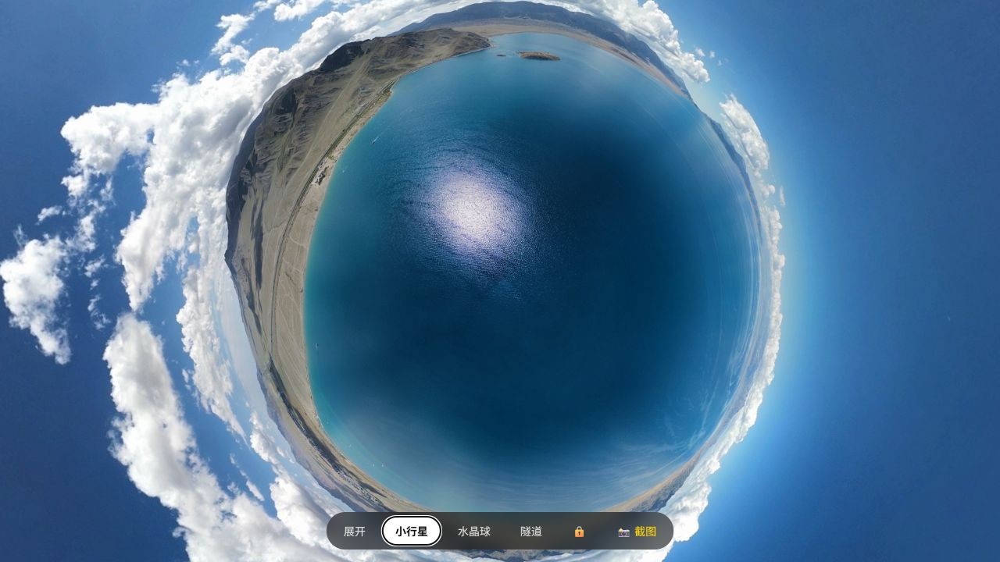
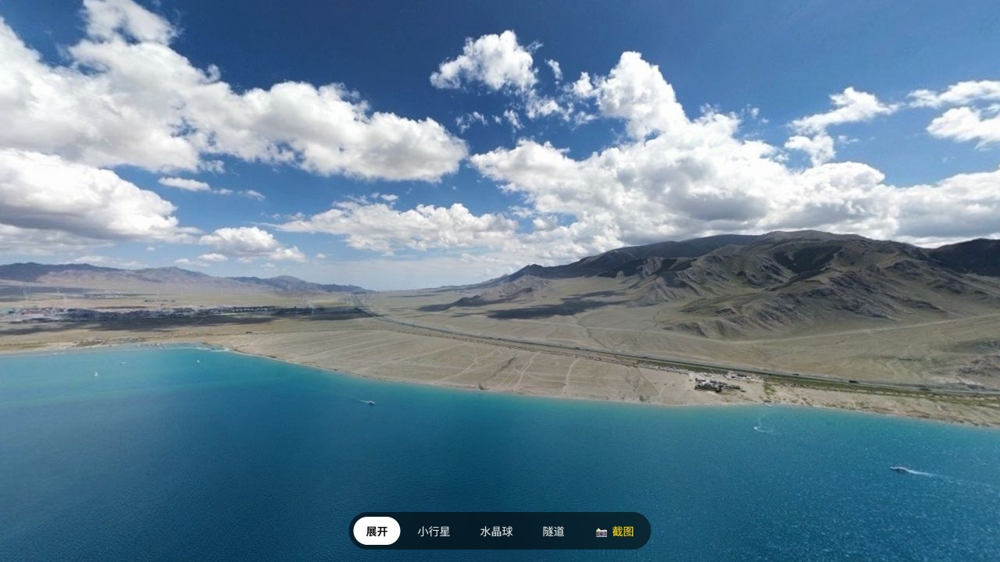
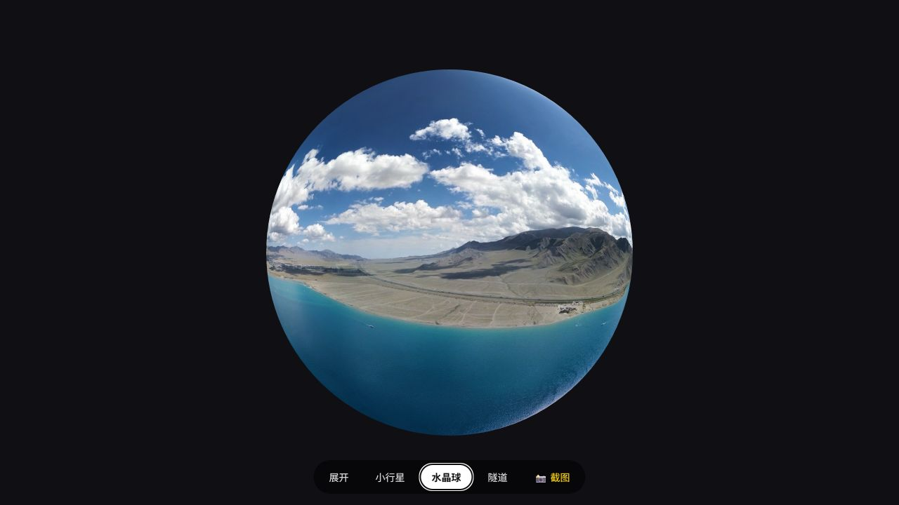
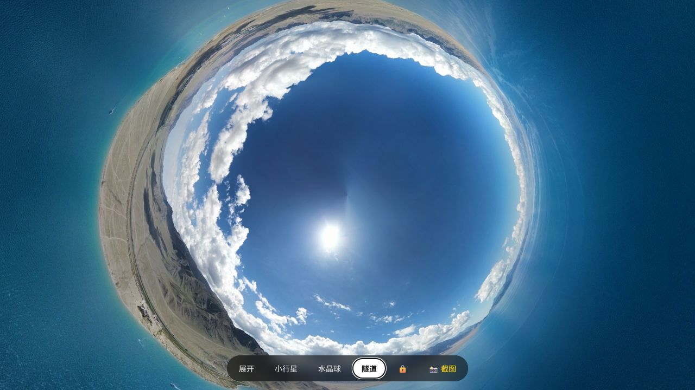

# PanoViewer

English | [简体中文](README.md)

A free, open-source, fully offline viewer for 360° panorama photos. PanoViewer displays equirectangular panoramas in four interactive modes: unfolded, tiny planet, crystal globe, and tunnel. Your photos stay on your device.

> Current version: **1.0.1** · Author: **Liang Xiaohui (梁晓辉)** · [MIT License](LICENSE)



<p align="center">
  
  
  
</p>

<p align="center"><sub>Demo panorama photographed in Xinjiang by Liang Xiaohui.</sub></p>

## Download and use

### Windows

1. Download `PanoViewer-Windows-x64.exe` from the [latest release](https://github.com/liang-xiaohui/PanoViewer/releases/latest).
2. Run it and choose a 360° panorama photo.
3. You can also drag a photo onto the EXE or select PanoViewer from Windows **Open with**.

The v1.0.0 executable is not commercially code-signed, so Windows SmartScreen may show a warning. Confirm that the file came from this repository's Releases page. Every release includes `SHA256SUMS.txt` for integrity verification.

### macOS

1. Download `PanoViewer-macOS.dmg` from [Releases](https://github.com/liang-xiaohui/PanoViewer/releases/latest).
2. Open the DMG, drag PanoViewer to Applications, then launch it or drop a panorama onto its icon.
3. The macOS app is not yet notarized by Apple. If macOS blocks the first launch, Control-click the app in Finder and choose Open. If it is still blocked, go to System Settings → Privacy & Security, find the PanoViewer security notice, and choose Open Anyway.

### iPhone / iPad Shortcut

1. Download and install `PanoViewer.shortcut` from [Releases](https://github.com/liang-xiaohui/PanoViewer/releases/latest).
2. Open a 360° panorama in Photos, tap Share, then choose PanoViewer.
3. The shortcut downloads the viewer template, processes the photo locally, and opens it in a Safari web view. The photo is never uploaded, but the shortcut needs access to GitHub to download the template.

### Linux and other platforms

Download `PanoViewer-Standalone.html` from the latest release, open it in a modern WebGL browser, then click or drag in a photo. The file includes everything it needs and works without a server, installation, or internet connection.

Alternatively, use the Python launcher from source:

```bash
python3 scripts/build.py
python3 scripts/pano.py /path/to/panorama.jpg
```

## Features

- Unfolded, tiny-planet, crystal-globe, and tunnel views
- Mouse, touch, wheel, and pinch controls
- Free tilt and projection locking in polar modes
- PNG snapshots of the current view
- JPG, JPEG, PNG, WebP, and GIF input
- Single-file, serverless, cloud-free operation

PanoViewer is designed for 2:1 equirectangular images produced by 360 cameras, drones, or panorama-stitching software.

## Privacy

PanoViewer reads and renders photos locally. It does not upload images, collect analytics, or include advertising code. The Windows launcher creates a temporary local HTML file for display in your default browser.

## Build from source

Python 3 is required. Building the Windows EXE also uses the .NET Framework C# compiler included with Windows.

```powershell
py -3 scripts\build.py
powershell -ExecutionPolicy Bypass -File scripts\build_windows.ps1
```

Build output is written to `dist/`. See [docs/DEVELOPMENT.md](docs/DEVELOPMENT.md) for implementation, testing, and release details.

## Contributing and security

Issues and pull requests are welcome. Read [CONTRIBUTING.md](CONTRIBUTING.md) before submitting changes. Please report security vulnerabilities privately as described in [SECURITY.md](SECURITY.md).

## License and third-party code

PanoViewer is released by Liang Xiaohui under the [MIT License](LICENSE).

`vendor/three.min.js` is three.js r128, also under the MIT License, copyright mrdoob and the three.js contributors.
